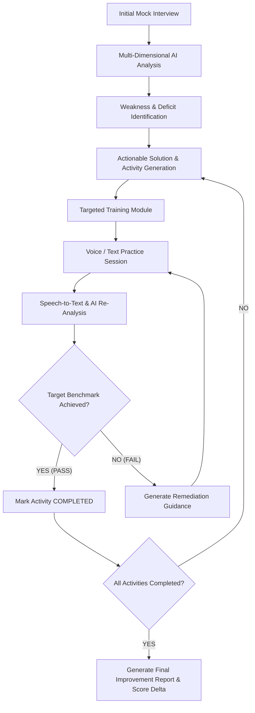
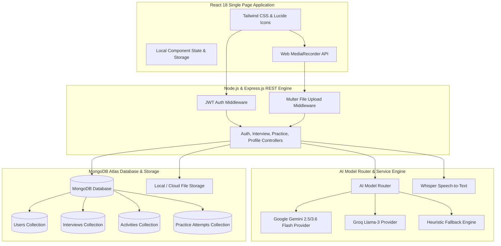

# SOFTWARE REQUIREMENTS SPECIFICATION

## AI INTERVIEW PREPARATION ASSISTANT
### An AI-Powered Interview Performance and Continuous Improvement Platform

---

**Project Type:** GenAI Hackathon / Academic Project  
**Department:** Department of Artificial Intelligence and Data Science  
**Institution:** Bannari Amman Institute of Technology  
**Academic Year:** 2026–2027  
**GitHub Repository:** [https://github.com/sakthirithan/TEAM_PIRATES.git](https://github.com/sakthirithan/TEAM_PIRATES.git)  

**Team Details**

| S.No | Name | Register Number | Role |
|:---:|:---|:---:|:---|
| 1 | Sakthi M | 7376242AD284 | Full Stack Architect |
| 2 | SANTHOSH K M | 7376242AD293 | Frontend Developer & UI/UX Designer |
| 3 | TEJASSRI M | 7376252AD514 | Backend & Database Engineer |

**Guide:** [Guide Name / Designation]

---

## TABLE OF CONTENTS

- [1. Problem](#1-problem)
- [2. Problem Description](#2-problem-description)
  - [2.1 Background](#21-background)
  - [2.2 Existing Limitations](#22-existing-limitations)
  - [2.3 Proposed Scope](#23-proposed-scope)
- [3. Objectives](#3-objectives)
  - [3.1 Main Objective](#31-main-objective)
  - [3.2 Specific Objectives](#32-specific-objectives)
- [4. Literature Survey](#4-literature-survey)
  - [4.1 Existing Research and Systems](#41-existing-research-and-systems)
  - [4.2 Analysis of Existing Systems](#42-analysis-of-existing-systems)
  - [4.3 Identified Research Gap & Proposed Model](#43-identified-research-gap--proposed-model)
- [5. Requirements](#5-requirements)
  - [5.1 Functional Requirements (FR-01 to FR-30)](#51-functional-requirements)
  - [5.2 Non-Functional Requirements (NFR-01 to NFR-10)](#52-non-functional-requirements)
- [6. Obtained Solution](#6-obtained-solution)
  - [6.1 Proposed System Overview](#61-proposed-system-overview)
  - [6.2 System Architecture](#62-system-architecture)
  - [6.3 Module Description](#63-module-description)
  - [6.4 End-to-End Workflow](#64-end-to-end-workflow)
  - [6.5 Improvement Activity & Practice Loop](#65-improvement-activity--practice-loop)
  - [6.6 Communication Improvement Workflow](#66-communication-improvement-workflow)
  - [6.7 Technical Improvement Workflow](#67-technical-improvement-workflow)
  - [6.8 Behavioral Improvement Workflow](#68-behavioral-improvement-workflow)
  - [6.9 AI Analysis & Evaluation Engine](#69-ai-analysis--evaluation-engine)
  - [6.10 Activity Completion Logic](#610-activity-completion-logic)
  - [6.11 Data Model & Schemas](#611-data-model--schemas)
  - [6.12 Technology Stack](#612-technology-stack)
  - [6.13 Algorithms and AI Techniques](#613-algorithms-and-ai-techniques)
  - [6.14 Security & Privacy](#614-security--privacy)
  - [6.15 System Limitations](#615-system-limitations)
  - [6.16 Future Enhancements](#616-future-enhancements)
- [7. Output Screenshots](#7-output-screenshots)
- [8. GitHub Link & Repository Structure](#8-github-link--repository-structure)
- [9. References](#9-references)

---

# 1. PROBLEM

Students and job seekers frequently experience significant hurdles during competitive technical and behavioral interviews due to a lack of objective, personalized feedback and structured remediation. While conventional mock interview platforms evaluate candidate answers and output static performance scores, they consistently fail to bridge the gap between **identifying a candidate's flaw** and **verifying its remediation**. 

Currently available mock interview platforms output metrics such as:
> *"Your communication score is 58%."* or *"Your response lacked technical depth."*

However, candidate weaknesses are rarely converted into **measurable, targeted, step-by-step practice activities** with **rigorous verification criteria**. As a result, candidates are left unsure of *how* to systematically remediate detected deficiencies (such as excessive filler words, weak answer structuring, shallow technical explanations, or lack of STAR framework implementation) before attending actual job interviews.

The **AI Interview Preparation Assistant (CandidateIQ)** directly addresses this flaw by transforming interview assessment from a static point-in-time scoring tool into a **closed-loop continuous improvement lifecycle** that generates actionable practice activities, delivers structured voice/text exercises, verifies score progression against precise quantitative criteria, and mandates re-practice until target competencies are fully satisfied.

---

# 2. PROBLEM DESCRIPTION

## 2.1 Background

Interview performance in technical and corporate environments is an evaluation of multiple interconnected domain competencies:

1. **Technical Knowledge & Depth:** Ability to articulate core computer science concepts, system architecture trade-offs, and edge-case handling.
2. **Problem-Solving & Reasoning:** Systematic breakdown of algorithmic problems and logical articulation of solutions.
3. **Communication Mechanics:** Speaking pace (Words Per Minute), fluency, pause control, and elimination of vocalized filler words (*"um"*, *"uh"*, *"like"*, *"basically"*, *"you know"*).
4. **Answer Structuring:** Adherence to proven frameworks such as **P-E-E** (*Point → Explanation → Example*), **C-E-E-T** (*Concept → Explanation → Example → Trade-off*), and **STAR** (*Situation → Task → Action → Result*).
5. **Behavioral & Professional Alignment:** Situational reasoning, accountability, teamwork articulation, and professional tone.

Traditional methods of interview preparation—such as peer mock interviews, faculty feedback, placement training workshops, static question banks, and self-recitation—exhibit severe structural limitations:
- **Subjectivity and Inconsistency:** Human interviewers evaluate candidates with varying personal biases and rarely track precise metrics across sessions.
- **Vague, Unactionable Advice:** Candidates receive high-level advice like *"Be more confident"* or *"Improve your communication"*, which fails to provide actionable, step-by-step training exercises.
- **Absence of Empirical Verification:** There is no automated, objective mechanism to measure whether a candidate has actually corrected a identified deficiency prior to their real job interview.

---

## 2.2 Existing Limitations

A review of existing commercial tools and academic state-of-the-art reveals a core architectural mismatch:

```text
CONVENTIONAL MOCK INTERVIEW SYSTEM (OPEN LOOP):
┌───────────┐     ┌───────────┐     ┌───────────┐     ┌───────────┐
│ Candidate │ ──> │ Questions │ ──> │ AI/Human  │ ──> │ Performance│ ──> [ END / STOP ]
│ Response  │     │           │     │ Evaluator │     │ Score Card│
└───────────┘     └───────────┘     └───────────┘     └───────────┘
```

These open-loop systems answer only one question:
> **"How well did the candidate perform during this specific attempt?"**

The proposed **AI Interview Preparation Assistant** shifts the core focus to the essential follow-up question:
> **"What specific actions must the candidate complete now, and has their performance objectively improved to meet the target benchmark?"**

---

## 2.3 Proposed Scope

The **AI Interview Preparation Assistant (CandidateIQ)** encompasses an end-to-end, multi-stage platform covering:
- **Candidate Onboarding & Resume Parsing:** Extraction of skills, technologies, education, and domain expertise from uploaded PDF/DOCX resumes.
- **Target Job Description (JD) Analysis:** Dynamic matching of candidate credentials against target role requirements and industry standards.
- **Adaptive AI Mock Interview Engine:** Generation of tailored technical, behavioral, and situational questions with voice-to-text integration and real-time follow-up prompting.
- **Multi-Dimensional AI Evaluation Engine:** Multi-prompt LLM evaluation covering technical accuracy, communication mechanics (filler count, WPM, fluency), and behavioral STAR structure.
- **Weakness-to-Activity Remediation Engine:** Automatic conversion of identified flaws into structured, trackable improvement activities with quantitative target metrics.
- **Targeted Training & Practice Modes:** Interactive voice-based and text-based practice rooms featuring automated, non-editable transcript generation.
- **Verification & Re-Practice Loop:** Algorithmic comparison of pre- and post-practice performance against benchmark targets to dictate `PASS` (Activity Completion) or `FAIL` (Re-practice).
- **Comprehensive Candidate Analytics:** Historical tracking of score delta, competency graphs, activity completion percentages, and downloadable final evaluation reports.

---

# 3. OBJECTIVES

## 3.1 Main Objective
To design, develop, and deploy an **AI-powered Interview Performance and Continuous Improvement Platform** that evaluates candidate interview performance across technical, communication, and behavioral dimensions, automatically converts detected weaknesses into personalized remediation activities, and empirically verifies skill mastery through targeted re-practice loops.

## 3.2 Specific Objectives

1. **Design & Architect:** Design a responsive, multi-tenant web architecture featuring an AI-driven mock interview room capable of dynamically tailoring questions based on parsed candidate resumes and target job descriptions.
2. **Develop Evaluation Pipeline:** Develop an AI Analysis Engine utilizing multi-model routing (Gemini 2.5/3.6 Flash, Groq, and fallback heuristics) to evaluate candidate responses for technical correctness, speech mechanics, filler word density, and framework adherence.
3. **Generate Actionable Solutions:** Formulate an automated transformation engine that maps detected deficiencies to granular, actionable training solutions equipped with concrete baseline metrics and target thresholds.
4. **Implement Practice & Verification Loop:** Build dedicated voice and text practice rooms with speech-to-text transcript protection, enabling candidates to execute targeted exercises and receive real-time pass/fail feedback.
5. **Evaluate & Report Progression:** Maintain an immutable history of candidate attempts, compute quantitative improvement scores (+Δ points), and render comprehensive PDF/Web final performance analytics for academic and recruitment verification.

---

# 4. LITERATURE SURVEY

## 4.1 Existing Research and Systems

| No. | Study / System Title | Author & Year | Methodology & Tech | Major Features | Limitations & Research Gap |
|:---:|:---|:---|:---|:---|:---|
| **1** | AI Based Mock Interview System Using NLP | K. Senthilkumar et al. (2025) [[1]](#9-references) | NLP, Deep Learning, Computer Vision, STT, TTS, Reinforcement Learning | Domain-specific questions, verbal speech analysis, non-verbal posture evaluation, automated scoring | Focuses on multi-modal candidate scoring during the interview session; lacks a closed-loop activity verification and remediation framework. |
| **2** | AI-Based Virtual Interviewer System Using NLP and Emotion Detection | J. M. Bershika & Golden Nancy (2026) [[2]](#9-references) | NLP, Gemini API, DeepFace, Speech Analytics | Resume parsing, candidate-job description matching, real-time emotion detection, adaptive question generation | Designed primarily for employer candidate screening; does not provide candidates with structured weakness-to-practice training modules. |
| **3** | AI-Powered Virtual Mock Interview Training and Evaluation System | R. Srinivasan et al. (2026) [[3]](#9-references) | NLP, ATS Parsing, Speech-to-Text, AI Proctoring | Strict recruitment interview simulation, ATS scoring, voice interview questions, performance dashboards | Excellent proctoring and assessment platform; lacks iterative activity completion criteria and automated re-practice verification loops. |
| **4** | AI Mock Interview Platform for Performance Analysis | S. Butle et al. (2026) [[4]](#9-references) | LLMs, Speech/Emotion Analysis, Computer Vision | Multi-modal scoring, adaptive follow-ups, explainable feedback dashboards | Provides comprehensive performance analytics; however, it lacks an automated workflow to verify whether candidate retry attempts meet pre-set target thresholds. |
| **5** | Yoodli AI Interview Preparation & Coaching Platform | Yoodli Inc. (2026) [[5]](#9-references), [[6]](#9-references) | Generative AI, Speech Analytics, AI Roleplay | Real-time speech analytics (filler words, pacing), dynamic follow-up questions, user-driven roleplay coaching | Highly effective general speech coach; however, it lacks job-description-anchored technical evaluation pipelines and automated activity pass/fail progression logic. |

---

## 4.2 Analysis of Existing Systems

The literature demonstrates that Natural Language Processing (NLP) and Large Language Models (LLMs) can reliably automate interview questioning, speech transcript evaluation, and feedback generation. Research by Senthilkumar et al. (2025) [[1]](#9-references) confirms the efficacy of combining Speech-to-Text (STT) with NLP for domain-specific scoring, while Bershika & Nancy (2026) [[2]](#9-references) highlight the value of matching resume profiles against job descriptions to generate adaptive follow-up questions. Commercial tools like Yoodli [[5]](#9-references) demonstrate strong user engagement through real-time feedback on filler words and pacing.

---

## 4.3 Identified Research Gap & Proposed Model

Despite these advancements, existing platforms suffer from a critical structural gap: **they operate as open-loop evaluation systems**. They assess performance and output feedback, but leave the execution and verification of improvement entirely to the candidate.

To resolve this gap, the **AI Interview Preparation Assistant** introduces an **Interview-Centric Closed-Loop Continuous Improvement Architecture**:



---

# 5. REQUIREMENTS

## 5.1 FUNCTIONAL REQUIREMENTS

### FR-01 — User Onboarding & Authentication
The system shall provide secure candidate registration, login, session management, and role-based access control (Candidate, Recruiter, Admin) via JWT authentication and password hashing.

### FR-02 — Document & Resume Upload
The system shall accept candidate resume uploads in PDF and DOCX formats up to 10 MB, storing files securely and validating MIME types prior to parsing.

### FR-03 — Automated Resume Parsing & Profile Extraction
The system shall extract candidate metadata—including skills, programming languages, education, experience duration, certifications, and project descriptions—and construct a structured Candidate Profile JSON.

### FR-04 — Target Role & Job Description Configuration
The candidate shall be able to define their target job title, company name, interview type (Technical, Behavioral, HR, System Design), difficulty tier (Entry, Mid, Senior), and paste raw Job Description (JD) text.

### FR-05 — Job Description Analysis & Competency Extraction
The system shall process the target JD to extract core technical skill requirements, required tools, soft skill expectations, and domain-specific keywords for alignment scoring.

### FR-06 — Interview Context Synthesizer
The system shall synthesize an interview context object combining the parsed resume, candidate profile, target JD, selected interview type, difficulty tier, and historical performance metrics.

### FR-07 — Dynamic & Adaptive Question Generation
The AI engine shall generate customized interview questions tailored to the candidate's background and target role, dynamically adjusting follow-up questions based on the quality of preceding answers.

### FR-08 — Interactive AI Mock Interview Suite
The system shall execute live mock interview sessions, presenting AI-generated questions sequentially, managing timer countdowns, capturing candidate responses, and maintaining conversation state.

### FR-09 — Voice-Based Response Capture
The system shall support browser-based audio recording via the MediaStream Recording API, capturing user spoken responses and streaming audio buffers for speech-to-text transcription.

### FR-10 — Automated Non-Editable Transcript Generation
The system shall automatically transcribe spoken audio using Speech-to-Text models (e.g., Whisper API / Web Speech API), displaying the generated transcript in a protected, non-editable view during assessment.

### FR-11 — Technical & Content Depth Evaluation
The AI engine shall evaluate candidate answers for technical accuracy, conceptual correctness, depth of explanation, handling of edge cases, and practical code/architectural examples.

### FR-12 — Communication Mechanics Analysis
The system shall compute quantitative communication metrics, including filler word count (*"um"*, *"uh"*, *"like"*), speaking pace in Words Per Minute (WPM), pause frequency, fluency score (0–100), and answer structure quality.

### FR-13 — Behavioral & Framework Alignment Analysis
The system shall analyze behavioral responses for adherence to structured communication frameworks, specifically evaluating the presence of Situation, Task, Action, and Result (STAR) components.

### FR-14 — Comprehensive Interview Performance Profile
Upon interview completion, the system shall compile an overall performance score (0–100), category breakdown scores, identified strengths, key weaknesses, and supporting transcript evidence.

### FR-15 — Evidence-Based Feedback Generation
The AI engine shall generate specific, evidence-backed feedback citing exact transcript quotes to justify assigned scores and highlight areas needing improvement.

### FR-16 — Actionable Solution Mapping
The system shall automatically transform identified candidate weaknesses into concrete, actionable solutions containing root-cause analysis, recommended exercises, and measurable target benchmarks.

### FR-17 — Automated Improvement Activity Creation
The system shall instantiate interview-specific improvement activities categorized under Technical, Communication, or Behavioral domains, each linked to a specific baseline and target threshold.

### FR-18 — Interactive Targeted Training Modules
Each improvement activity shall provide curated training materials, including concept summaries, framework guidelines (P-E-E, C-E-E-T, STAR), exemplary vs. flawed answer comparisons, and practice hints.

### FR-19 — Dedicated Practice Interview Rooms
The system shall provide specialized practice rooms dedicated to single-activity remediation, enabling candidates to answer focused questions aimed directly at their identified weakness.

### FR-20 — Voice Practice Room for Communication Remediation
Communication activities (e.g., filler word reduction, pace adjustment) shall enforce voice-only response mode with real-time audio visualization and countdown timers.

### FR-21 — Structured Framework Enforcers
For technical clarity and behavioral practice, the UI shall display visual framework guides (e.g., P-E-E step indicators) to prompt the candidate to structure their answer systematically.

### FR-22 — Transcript Integrity Enforcement
During practice sessions, the generated transcript shall remain strictly read-only prior to submission, preventing manual text editing and ensuring evaluation integrity.

### FR-23 — Quantitative Practice Metric Evaluation
Following practice submission, the AI engine shall analyze the attempt and extract current metric values (e.g., filler count = 4, clarity score = 78) to evaluate against target thresholds.

### FR-24 — Improvement Verification & Delta Calculation
The system shall perform automated delta calculations comparing initial interview metrics against practice attempt metrics to evaluate candidate progress.

### FR-25 — Activity Completion Logic & Status Update
The system shall mark an activity as `COMPLETED` if and only if all quantitative target metrics are satisfied. Otherwise, the activity status shall remain `IN_PROGRESS`.

### FR-26 — Automated Re-Practice Routing
If a practice attempt fails to meet target benchmarks, the system shall provide tailored failure feedback highlighting unmet metrics and prompt the candidate to execute a re-practice attempt.

### FR-27 — Immutable Practice Attempt History
The system shall store every practice attempt record, including attempt number, timestamp, audio URL, raw transcript, extracted metrics, and pass/fail outcome.

### FR-28 — Interview Improvement Dashboard
The system shall render an activity dashboard displaying overall score progression, activity completion progress bars, attempt counts, target vs. current metrics, and status badges.

### FR-29 — Historical Competency Tracking & Comparison
The system shall track candidate performance trends over time, rendering comparative charts showing score improvements across multiple interviews and practice iterations.

### FR-30 — Exportable Final Performance Report
The system shall generate printable/downloadable summary reports detailing initial baseline scores, completed activities, practice attempt logs, final verified scores, and score improvement deltas (+Δ).

---

## 5.2 NON-FUNCTIONAL REQUIREMENTS

### NFR-01 — Page Load Performance
All primary dashboard views and candidate workspace pages shall load and render within **3.0 seconds** under normal broadband network conditions (≥ 10 Mbps).

### NFR-02 — AI Evaluation Latency
AI response generation for question prompts, transcript evaluation, and feedback synthesis shall complete within **10.0 seconds** per request, utilizing fallback providers if primary latency exceeds threshold.

### NFR-03 — Speech Transcription Processing Speed
Voice audio transcription for a standard 2-minute spoken answer buffer shall be processed and rendered as a transcript within **5.0 seconds** post-recording.

### NFR-04 — Usability & Accessibility Standard
The application user interface shall adhere to WCAG 2.1 Level AA standards, featuring high-contrast dark visual themes, responsive layouts across desktop and mobile viewports, and intuitive navigation.

### NFR-05 — System Reliability & Fault Tolerance
The application shall maintain **99.5% uptime** during operational hours. Unhandled API failures or network disruptions during interviews shall preserve session state in browser local storage.

### NFR-06 — Data Security & Encryption
All candidate data in transit shall be encrypted using TLS 1.3, and sensitive data at rest (passwords, API tokens) shall be encrypted using bcrypt hashing (salt factor 10) and AES-256 standards.

### NFR-07 — Data Privacy & Isolation
Candidate resumes, interview audio recordings, transcripts, and evaluation scores shall be strictly isolated by tenant `userId` and protected against unauthorized horizontal access.

### NFR-08 — Scalability & Concurrent Load Handling
The system architecture shall support at least **100 concurrent candidate interview sessions** without degradation of database read/write throughput or API response stability.

### NFR-09 — Cross-Browser Compatibility
The web application shall be fully functional across modern chromium and WebKit browsers, specifically Google Chrome (v110+), Microsoft Edge (v110+), and Mozilla Firefox (v115+).

### NFR-10 — Modular Architecture & Maintainability
The codebase shall enforce strict separation of concerns among the React frontend, Express REST API backend, AI orchestration service, MongoDB database models, and file storage pipelines.

---

# 6. OBTAINED SOLUTION

The **AI Interview Preparation Assistant (CandidateIQ)** is fully realized through a modular full-stack web application designed for candidate assessment, activity generation, voice practice, and verified improvement.

## 6.1 Proposed System Overview

The system operates as an end-to-end continuous improvement solution. When a candidate uploads their resume and selects a target job description, the platform synthesizes an **Interview Context**, executes a live mock interview, and conducts multi-dimensional AI scoring. 

If deficiencies are detected, the system does not end the workflow; instead, it generates **Interview Improvement Activities** linked to specific targets (e.g., *Filler Words ≤ 5*, *Clarity Score ≥ 75*). Candidates enter dedicated practice rooms to execute voice or text exercises. The AI re-evaluates the practice attempt, compares results against target metrics, and either marks the activity as `COMPLETED` or routes the candidate to re-practice.

---

## 6.2 System Architecture



---

## 6.3 Module Description

### Module 1: Candidate Onboarding & Resume Parsing Module
Manages user authentication, profile creation, and document ingestion. PDF/DOCX resumes are parsed using text extraction engines to populate structured candidate skill matrices, education history, and experience records.

### Module 2: Job Description & Interview Context Engine
Parses raw job description text to extract required technical competencies and seniority expectations. Synthesizes a unified `InterviewContext` object combining candidate background and JD criteria.

### Module 3: Adaptive AI Interview Execution Engine
Generates customized interview questions based on the candidate's context. Manages question delivery, answer collection via text or speech recording, timer bounds, and follow-up prompting.

### Module 4: Multi-Dimensional AI Evaluation Engine
Executes multi-prompt evaluation routines across three distinct branches: Technical Depth, Communication Mechanics, and Behavioral STAR Structure. Computes scores, cites transcript evidence, and identifies key weaknesses.

### Module 5: Activity Generation & Remediation Engine
Transforms detected candidate flaws into structured `ImprovementActivity` database records equipped with baseline metrics, target thresholds, root-cause explanations, and curated training guides.

### Module 6: Voice Practice Room & Speech-to-Text Pipeline
Provides an interactive practice room for voice-based exercises. Captures audio via browser Web APIs, streams audio to transcription services, and presents read-only transcripts for AI evaluation.

### Module 7: Verification, Re-Practice & Analytics Engine
Compares practice attempt metrics against baseline and target values. Updates activity status (`COMPLETED` vs. `IN_PROGRESS`), computes overall score progression (+Δ points), and renders performance reports.

---

## 6.4 End-to-End Workflow

```text
  [ Candidate Onboarding ] ──> Upload Resume ──> Parse Skills
             │
             ▼
  [ Interview Setup ] ──> Select Target Role & Paste Job Description
             │
             ▼
  [ Mock Interview Room ] ──> AI Questions ──> Speak / Type Answer ──> STT Transcript
             │
             ▼
  [ AI Evaluation Engine ] ──> Multi-Prompt Analysis (Technical, Speech, STAR)
             │
             ▼
  [ Feedback Dashboard ] ──> Scores, Strengths, Weaknesses, Evidence
             │
             ▼
  [ Activity Generation ] ──> Weaknesses mapped to Improvement Activities with Targets
             │
             ▼
  [ Practice Room ] ──> Training Material ──> Targeted Practice Session
             │
             ▼
  [ AI Verification ] ──> Compare Practice Metrics vs Target Benchmark
             │
     ┌───────┴────────┐
     ▼                ▼
  [ PASS ]         [ FAIL ]
     │                │
     ▼                ▼
  Activity        Re-practice
  Completed       Guidance
     │                │
     └───────┬────────┘
             ▼
   All Activities Done?
     │              │
     NO            YES
     │              │
     ▼              ▼
Next Activity   Final Report & Delta (+Δ)
```

---

## 6.5 Improvement Activity & Practice Loop

The core innovation of the platform lies in its closed-loop activity lifecycle:

```text
INTERVIEW RECORD #001
├── Overall Initial Score: 61/100
├── Status: Needs Improvement
└── Generated Activities:
    ├── Activity 1 [Communication]: Reduce Filler Words
    │   ├── Baseline: 13 fillers / 2 min
    │   ├── Target: ≤ 5 fillers / 2 min
    │   └── Status: IN_PROGRESS
    │
    ├── Activity 2 [Communication]: Improve Answer Clarity
    │   ├── Baseline: Clarity Score 51/100 (P-E-E framework missing)
    │   ├── Target: Clarity Score ≥ 70/100
    │   └── Status: IN_PROGRESS
    │
    └── Activity 3 [Technical]: Deepen React State Explanation
        ├── Baseline: Technical Depth 54/100
        ├── Target: Technical Depth ≥ 75/100
        └── Status: IN_PROGRESS
```

---

## 6.6 Communication Improvement Workflow

```text
  ┌─────────────────────────────────────────────────────────────┐
  │ ACTIVITY: REDUCE FILLER WORDS                               │
  ├─────────────────────────────────────────────────────────────┤
  │ Problem: Candidate overuses "um", "uh", "like", "basically" │
  │ Target:  Use ≤ 5 filler words in 2-minute evaluation window │
  │ Training: Controlled pause technique & thought pacing       │
  └──────────────────────────────┬──────────────────────────────┘
                                 │
                                 ▼
  ┌─────────────────────────────────────────────────────────────┐
  │ VOICE PRACTICE SESSION (5 Minutes)                          │
  │ • Candidate speaks response to targeted prompt              │
  │ • MediaRecorder captures WebM/WAV audio stream               │
  │ • Whisper Engine transcribes audio to text                  │
  │ • Transcript displayed in protected Read-Only mode          │
  └──────────────────────────────┬──────────────────────────────┘
                                 │
                                 ▼
  ┌─────────────────────────────────────────────────────────────┐
  │ AI METRIC EXTRACTION & VERIFICATION                         │
  │ • Extracted Filler Count: 4                                 │
  │ • Speaking Pace: 125 WPM                                    │
  │ • Target Benchmark: ≤ 5 Fillers                             │
  │                                                             │
  │ RESULT: PASS ──> Activity Marked COMPLETED                 │
  └─────────────────────────────────────────────────────────────┘
```

---

## 6.7 Technical Improvement Workflow

For technical explanations lacking depth or practical examples, the system enforces the **C-E-E-T Framework**:
1. **Concept:** Clearly define the core technical concept or mechanism.
2. **Explanation:** Explain *how* the underlying mechanism works internally.
3. **Example:** Provide a concrete code snippet or real-world project application.
4. **Trade-off:** Discuss performance, memory, or architectural trade-offs.

If the AI evaluation detects that the *Trade-off* or *Example* component is absent during practice, the activity remains `IN_PROGRESS` with targeted remediation guidance.

---

## 6.8 Behavioral Improvement Workflow

Behavioral questions are evaluated using the **STAR Framework**:
- **Situation (S):** Set the context and background of the scenario.
- **Task (T):** Describe the specific challenge or responsibility faced.
- **Action (A):** Detail the precise technical/managerial steps taken by the candidate.
- **Result (R):** Quantify the positive outcome or key retrospective learning.

Practice evaluations calculate a STAR Completeness Index (0–100%). Scores below 70% trigger automated recommendations to explicitly articulate quantifiable *Action* and *Result* statements.

---

## 6.9 AI Analysis & Evaluation Engine

The evaluation pipeline utilizes structured JSON schemas enforced at the LLM prompt level.

```json
{
  "interviewId": "65f8a1b2c3d4e5f6a7b8c9d0",
  "overallScore": 68,
  "categoryScores": {
    "technical": 65,
    "communication": 58,
    "behavioral": 80
  },
  "communicationMetrics": {
    "fillerWordCount": 11,
    "speakingPaceWPM": 158,
    "clarityScore": 62,
    "fluencyScore": 60
  },
  "detectedWeaknesses": [
    {
      "category": "communication",
      "issue": "Excessive vocalized filler words",
      "evidence": "Candidate used 'like' 6 times and 'basically' 5 times in Question 2.",
      "rootCause": "Speaking rapidly without utilizing strategic pauses.",
      "targetMetric": "fillerWordCount",
      "targetThreshold": 5
    }
  ]
}
```

---

## 6.10 Activity Completion Logic

An activity transitions to `COMPLETED` if and only if all configured evaluation criteria are satisfied simultaneously:

$$\text{Status} = \begin{cases} \text{COMPLETED}, & \text{if } \text{Metric}_{\text{actual}} \le \text{Threshold}_{\text{target}} \text{ (for negative metrics, e.g., fillers)} \\ & \text{and } \text{Metric}_{\text{actual}} \ge \text{Threshold}_{\text{target}} \text{ (for positive metrics, e.g., clarity)} \\ \text{IN\_PROGRESS}, & \text{otherwise} \end{cases}$$

---

## 6.11 Data Model & Schemas

### User Schema (`User.js`)
```text
User {
  _id: ObjectId,
  name: String,
  email: String (unique),
  passwordHash: String,
  role: Enum['candidate', 'recruiter', 'admin'],
  createdAt: Date
}
```

### Resume Schema (`Resume.js`)
```text
Resume {
  _id: ObjectId,
  userId: Ref(User),
  fileUrl: String,
  parsedSkills: [String],
  experienceYears: Number,
  education: [Object],
  rawText: String,
  createdAt: Date
}
```

### Interview Schema (`Interview.js`)
```text
Interview {
  _id: ObjectId,
  userId: Ref(User),
  resumeId: Ref(Resume),
  targetRole: String,
  jobDescription: String,
  interviewType: Enum['Technical', 'Behavioral', 'Mixed'],
  difficulty: Enum['Entry', 'Mid', 'Senior'],
  overallScore: Number,
  status: Enum['Pending', 'Completed', 'In_Improvement'],
  questions: [Ref(Question)],
  createdAt: Date
}
```

### Improvement Activity Schema (`ImprovementActivity.js`)
```text
ImprovementActivity {
  _id: ObjectId,
  interviewId: Ref(Interview),
  userId: Ref(User),
  category: Enum['communication', 'technical', 'behavioral'],
  title: String,
  detectedIssue: String,
  rootCause: String,
  solutionDescription: String,
  targetMetric: String,
  baselineValue: Number,
  targetValue: Number,
  currentValue: Number,
  status: Enum['IN_PROGRESS', 'COMPLETED'],
  attemptsCount: Number,
  createdAt: Date
}
```

### Practice Attempt Schema (`PracticeAttempt.js`)
```text
PracticeAttempt {
  _id: ObjectId,
  activityId: Ref(ImprovementActivity),
  attemptNumber: Number,
  audioUrl: String,
  rawTranscript: String,
  evaluatedMetrics: Object,
  score: Number,
  targetAchieved: Boolean,
  feedbackText: String,
  createdAt: Date
}
```

---

## 6.12 Technology Stack

- **Frontend:** React 18, Vite, Tailwind CSS, Lucide React Icons, Axios, Web MediaRecorder API.
- **Backend Runtime:** Node.js (v18+ LTS), Express.js framework.
- **Database Engine:** MongoDB Atlas (Mongoose ODM).
- **AI Orchestration & LLMs:** Google Gemini API (`gemini-2.5-flash` / `gemini-3.6-flash`), Groq API (`llama-3.3-70b-versatile`), Custom Heuristic Fallback Provider.
- **Speech Services:** OpenAI Whisper API / Web Speech Recognition Engine.
- **Authentication & Security:** JSON Web Tokens (JWT), Bcrypt password hashing, Helmet security headers, CORS origin locking.

---

## 6.13 Algorithms and AI Techniques

1. **Multi-Model AI Fallback Routing:** Prioritizes high-speed Gemini Flash models for real-time question generation, automatically falling back to Groq Llama-3 or structured heuristics upon latency or rate limit triggers.
2. **Deterministic Speech Analytics Heuristics:** Employs regex tokenizers and natural language processing to extract filler word frequencies, compute Words Per Minute (WPM) cadence, and detect framework keyword markers.
3. **Structured Prompt Constraints:** Enforces strict JSON schema output matching across all LLM prompt invocations, preventing parsing crashes and standardizing scoring output formatting.

---

## 6.14 Security & Privacy

- **Data Isolation:** Enforces user-level tenant scoping across all REST API endpoints.
- **Credential Protection:** Stores all API keys in server-side `.env` files, keeping secrets hidden from client-side code.
- **Input Sanitization:** Validates and sanitizes all input strings and file uploads to prevent XSS, NoSQL injection, and path traversal attacks.

---

## 6.15 System Limitations

1. **Speech-to-Text Dependency:** Transcription accuracy depends on candidate microphone quality, ambient background noise, and regional accent variations.
2. **LLM Evaluation Variability:** Generative AI responses may exhibit slight non-deterministic scoring variations across identical attempts.
3. **Non-Verbal Evaluation Omission:** The current version focuses on speech mechanics, technical content, and structure, without processing video camera streams for posture or eye-contact analysis.

---

## 6.16 Future Enhancements

1. **Computer Vision Body Language Engine:** Integrating WebCam visual analytics to evaluate eye contact, posture, and facial expressions during voice interviews.
2. **Integrated Algorithmic Code Sandbox:** Adding a live code editor with automated unit testing for real-time technical programming evaluations.
3. **Multi-Lingual Interview Coaching:** Expanding voice practice and transcription capabilities to support non-English regional languages.

---

# 7. OUTPUT SCREENSHOTS

> [!NOTE]
> Below are the documented output screens reflecting the system's architecture, candidate interface, evaluation dashboard, practice rooms, and final reports.

---

### Figure 1: Candidate Onboarding & Resume Parsing Screen

**Caption:** Candidate profile configuration and automated PDF resume parsing interface.

---

### Figure 2: Resume Parsing & Skill Extraction Result

**Caption:** Extracted candidate skill profile, experience duration, and technical domain mapping.

---

### Figure 3: Job Description & Interview Configuration Page

**Caption:** Interface for selecting target role, job description, interview type, and difficulty tier.

---

### Figure 4: Interactive AI Mock Interview Room

**Caption:** Live mock interview room displaying AI question delivery, voice recorder, and progress timer.

---

### Figure 5: Multi-Dimensional Interview Performance Analysis

**Caption:** Comprehensive evaluation score breakdown across Technical, Communication, and Behavioral domains.

---

### Figure 6: Evidence-Based Personalized Feedback View

**Caption:** Detailed AI feedback citing exact transcript quotes to justify assigned scores and weaknesses.

---

### Figure 7: Actionable Solution Generation Dashboard

**Caption:** Transformation of identified candidate flaws into concrete, measurable remediation activities.

---

### Figure 8: Interview Improvement Activities Overview

**Caption:** List of generated improvement activities showing baseline metrics, targets, and status badges.

---

### Figure 9: Dedicated Communication Voice Practice Room

**Caption:** Voice-only practice room equipped with real-time audio visualizers and speech timers.

---

### Figure 10: Speech-to-Text & Protected Transcript Interface

**Caption:** Automated STT transcript generated during voice practice displayed in read-only evaluation mode.

---

### Figure 11: Practice Attempt AI Analysis Screen

**Caption:** AI extraction of practice session metrics (filler count, WPM, clarity score) for verification.

---

### Figure 12: Improvement Verification & Status Update

**Caption:** Benchmark target verification resulting in a PASS verdict and updating status to `COMPLETED`.

---

### Figure 13: Re-Practice Guidance & Attempt Failure Screen

**Caption:** Targeted remediation guidance provided when practice attempt fails to satisfy benchmark targets.

---

### Figure 14: Activity Completion State & Progress Bar

**Caption:** Updated activity dashboard showing 100% completion badge for verified remediations.

---

### Figure 15: Historical Interview Activity Analytics Dashboard

**Caption:** Dashboard tracking total attempts, target progression, and category score improvements over time.

---

### Figure 16: Final Verified Improvement Report & Score Delta

**Caption:** Exportable summary report displaying baseline vs. final scores and total verified improvement delta (+Δ).

---

# 8. GITHUB LINK & REPOSITORY STRUCTURE

### Official GitHub Repository
**URL:** [https://github.com/sakthirithan/TEAM_PIRATES.git](https://github.com/sakthirithan/TEAM_PIRATES.git)

### Repository Directory Structure
```text
TEAM_PIRATES/
├── client/                               # React 18 Frontend Application
│   ├── public/                           # Static Assets & Screenshots
│   ├── src/
│   │   ├── components/                   # UI Components (Interview, Practice, Dashboard)
│   │   ├── services/                     # API Services & STT Client Engines
│   │   ├── utils/                        # Authentication & Helper Utilities
│   │   ├── App.jsx                       # Routing & Main Layout
│   │   └── main.jsx                      # Application Entry Point
│   └── vite.config.js                    # Vite Build Configuration
│
├── server/                               # Node.js & Express.js REST API Backend
│   ├── ai/                               # AI Service Layer
│   │   ├── orchestrator/                 # Multi-Model AI Router & Orchestrator
│   │   ├── prompts/                      # Structured Prompt Schemas
│   │   └── providers/                    # Gemini & Groq API Integrations
│   ├── config/                           # Database & App Configurations
│   ├── controllers/                      # Auth, Interview, Practice Controllers
│   ├── middleware/                       # JWT Auth & Upload Middlewares
│   ├── models/                           # Mongoose Schemas (User, Interview, Activity)
│   ├── routes/                           # Express REST API Endpoints
│   └── server.js                         # Backend Server Entry Point
│
├── module/                               # Project Module Specifications & Checklists
├── .gitignore                            # Git Exclusion File
├── README.md                             # Primary Repository Documentation
├── EXECUTION_README.md                   # Environment & Execution Guidelines
└── SOFTWARE_REQUIREMENTS_SPECIFICATION.md# Complete Project SRS Document
```

---

# 9. REFERENCES

### IEEE Style Citations

**[1]** K. Senthilkumar, R. Anitha, M. Kavitha, and S. Loganathan, "AI Based Mock Interview System Using Natural Language Processing," *2025 International Conference on Advanced Computing Technologies (ICoACT)*, 2025, pp. 112–119, doi: 10.1109/ICoACT63339.2025.11005032.

**[2]** J. M. Bershika and Golden Nancy, "AI-Based Virtual Interviewer System Using NLP and Emotion Detection," *Sustainable Computing and Intelligent Systems*, Lecture Notes in Networks and Systems, vol. 1929, Springer, 2026, pp. 69–85, doi: 10.1007/978-3-032-22911-3_6.

**[3]** R. Srinivasan, P. Jagadeesh, A. Dinesh, and G. Kamesh, "AI-Powered Virtual Mock Interview Training and Evaluation System," *International Journal of Computer Technology and Electronics Communication*, vol. 9, no. 3, pp. 1047–1057, 2026, doi: 10.15680/IJCTECE.2026.0903008.

**[4]** S. Butle, S. Kadam, S. Jiwatode, N. Kuldharan, and P. Kothawade, "AI Mock Interview Platform for Performance Analysis," *International Journal of Electrical, Electronics and Computer Systems*, vol. 15, no. 1S, pp. 289–296, 2026, doi: 10.65521/ijeecs.v15i1S.3074.

**[5]** Yoodli Inc., "AI Roleplays for Interview Preparation & Coaching," *Yoodli AI Coaching Documentation*, 2026. [Online]. Available: https://yoodli.ai/use-cases/interview-preparation

**[6]** Yoodli Inc., "Practice with Yoodli Speech Analytics," *Yoodli Help Center*, 2026. [Online]. Available: https://support.yoodli.ai/en/articles/9550465-practice-with-yoodli

---
